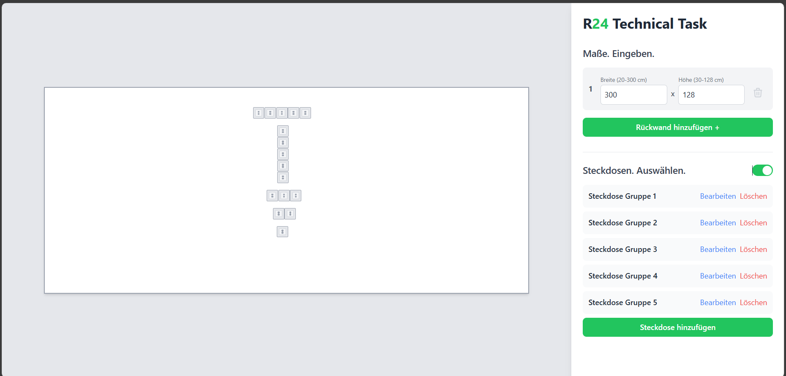

# Plate & Socket Generator

An interactive and responsive web application for generating, visualizing, and managing wall plates with configurable socket groups.  
Built with **React + Vite + TypeScript**, optimized for both desktop and mobile devices.

---

## Features

### Core Requirements

#### 🧱 Initial Plate Generation
* On load, a default plate with predefined dimensions is generated automatically.
* Plates scale dynamically to fit the canvas area while maintaining aspect ratios.
* All plates retain proportional scaling when multiple exist.

#### 📏 Dimension Representation and Scaling
* Real-world dimension mapping: **1 cm = 1 unit** internally.
* Visual scaling adapts to available canvas space.
* When only one plate exists, it expands to fill the canvas proportionally.

#### 🧩 Plate Management
* Users can **add**, **resize**, or **delete** plates (minimum 1 must remain).
* Width range: **20–300 cm**, Height range: **30–128 cm**.
* Resizing removes existing socket groups to ensure consistency.
* All input values are validated and clamped within valid limits.

#### 🔌 Socket Management
* Toggle sockets ON/OFF globally.
* When active, a default socket group is added to the first eligible plate.
* Plates smaller than **40×40 cm** are not eligible for sockets.
* Users can add or remove socket groups dynamically.

#### ⚙️ Socket Group Configuration
Each socket group supports:
* **Plate Selector** — reassign the group to another valid plate.  
* **Socket Count** — choose between **1–5 sockets per group**.  
* **Direction Selector** — horizontal or vertical arrangement.  
* **Position Inputs** — precise distances from the **left** and **bottom** edges in cm.

#### 📐 Socket Dimensions & Constraints
* Socket size: **7×7 cm**  
* Gap between sockets: **0.2 cm**  
* Minimum distance from plate edge: **3 cm**  
* Minimum distance between groups: **4 cm**  
* Sockets cannot overlap or exceed plate boundaries.

#### 🖱️ Dragging & Live Feedback
* Drag socket groups directly within the canvas.
* Real-time **guideline lines** show distances from edges (with live cm labels).
* Invalid drag or input positions trigger clear visual feedback.
* Invalid moves are **blocked** and revert to the last valid state.

#### 📱 Responsive & Interactive Canvas
* Fully responsive canvas that scales with browser size.
* Touch-friendly interactions for mobile and tablet devices.
* All elements re-render dynamically on window resize.

---


## Tech Stack

* **Framework:** React + Vite + TypeScript  
* **Styling:** CSS (mobile-first, responsive layout)  
* **State Management:** useState / Context API  
* **Canvas Rendering:** HTML + CSS scaling  
* **Validation Logic:** Custom utilities with numeric constraints  

---

## Installation & Setup

Clone the repository and install dependencies:

```bash
git clone https://github.com/<your-username>/<repo-name>.git
cd <repo-name>
npm install
```

Run the development server:

```bash
npm run dev
```

Build for production:

```bash
npm run build
```
---

## Live Demo

Deployed on Vercel: [Demo Link](https://your-demo-url.vercel.app/)

---

## Known Limitations / Assumptions

* Overlap detection currently applies to rectangular groups only.

* Drag performance may vary slightly on lower-end mobile devices.

* Sockets cannot yet be copied between plates (planned feature).

* No backend integration — all logic handled client-side.

## Screenshots



## License

For assessment and recruitment evaluation purposes only.